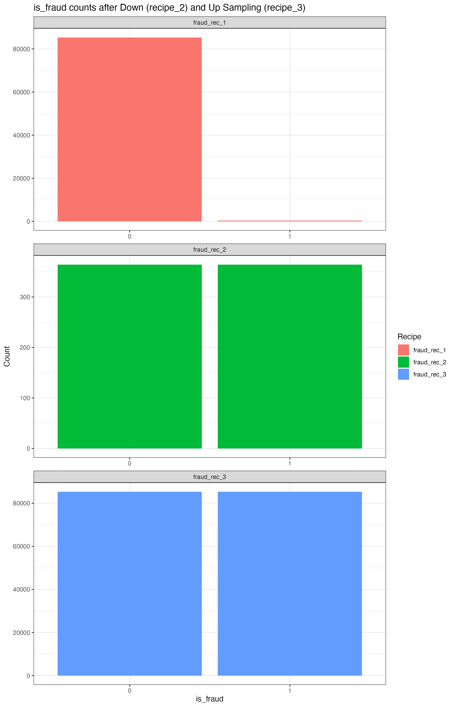
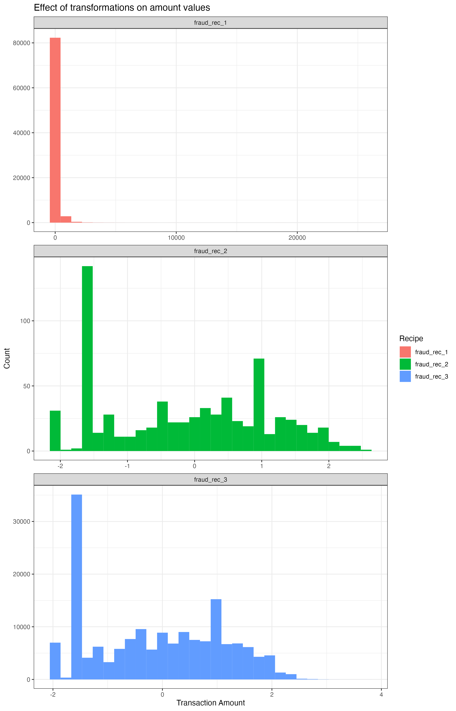

# Modeling Pipeline Case - Fraud Detection

## Introduction

Welcome to my fraud detection project! In my intro data science course, we used R to clean data and build a machine learning model to predict a response variable. This particular model leverages historical transaction data to identify patterns and anomalies indicative of fraudulent activities.

## Problem Statement

Fraudulent transactions result in significant financial losses and pose a reputational risk to organizations. In this project, I aimed to build a model that can accurately classify transactions as legitimate or fraudulent, thus mitigating potential losses and enhancing fraud prevention strategies.

## Data Overview

* **Dataset:** Historical transaction data with labeled instances of fraudulent and legitimate transactions. The dataset is highly unbalanced, as per usual with transaction data. The positive class (fraud) accounts for 0.172% of all transactions. See the dataset on Kaggle here: https://www.kaggle.com/datasets/mlg-ulb/creditcardfraud.
* **Features:** Transaction amount, timestamp, and 28 other PCA-transformed features of unknown column names due to privacy restrictions.
* **Label:** Fraud represented by 1 and normal transaction represented by 0. 
* **Size:** 284,807 transactions with 492 labeled as fraudulent.

## Methodology

1. **Data Preprocessing:**

   * Data Cleaning: The data was clean upon download from Kaggle.
   * Normalization & Downsampling: Various preprocessing techniques and model architectures are used to compare performance.
   * Feature Engineering: All available features were used in this model because this was the first iteration. Further investigation may surface features that worsen model performance, which would be candidates for removal. 
   * Data Splitting: 70% training, 30% testing.
  
   * Three different preprocessing recipes were used:
     * Recipe 1: Baseline with no transformations.
     * Recipe 2: Yeo-Johnson transformation, normalization, and downsampling.
     * Recipe 3: Range scaling, Box-Cox transformation, normalization, and upsampling.

2. **Model Selection:**

   * Logistic Regression and XGBoost models were employed using each preprocessing recipe.

3. **Model Evaluation:**

   * Accuracy, Precision, Recall, F1 Score, AUC-ROC.

4. **Deployment:**

   * Model was not deployed. A REST API is recommended for integration with transaction monitoring systems.

## Results and Findings

* The XGBoost model achieved an accuracy of **97%**[verify number], a recall of **92%**[verify number], and an AUC-ROC of **0.98**[verify number].
* Summary here like "High precision and recall indicate the model's effectiveness in minimizing false positives and false negatives."
* Summary here like "The model demonstrated robust performance on unseen data, validating its generalizability."

## Recommendations

* Integrate the model with real-time monitoring systems to detect fraud as transactions occur.
* Implement periodic retraining to maintain model accuracy with evolving fraud patterns.
* Develop a dashboard to visualize key fraud metrics and model performance.

## Next Steps

* Monitor model performance post-deployment.
* Incorporate feedback from fraud analysts to refine model features.
* Explore advanced algorithms such as neural networks for potential performance gains.

---

# Modeling Pipeline Case Assignment

If you thought the _last_ modeling pipeline assignment was fun, well, you're in for a real treat. This assignment will be the culmination of everything we've learned so far about building, refining, evaluating, and optimizing models using the `tidymodels` framework. Strap in. Because this is going to be a _blast_.

---

### 1. fraud, fraud_split, fraud_training, fraud_testing

The first dataset you'll be using is a fraud dataset that comes from real-world fraud data. Like most fraud datasets, the outcome you'll be classifying is extremely imbalanced (meaning that there are very few fraud cases relative to the rest of the population). This gave me a good opportunity to learn about a few strategies for dealing with imbalanced data. You'll be predicting `is_fraud` using a handful of other predictors, most of which have already been cleaned and transformed and have very uncreative names (`v1` through `v28`). 

Start by converting the `is_fraud` column to a factor, saving the result to `fraud`. Then use that `fraud` tibble to create a `fraud_split` object, followed by the corresponding `fraud_training` and `fraud_testing` tibbles. (Just make sure your code for this section comes _after_ the `set.seed(42)` I provided.)

> [!IMPORTANT] 
> After setting up your model pipeline, you should now have `fraud`, `fraud_split`, `fraud_training`, and `fraud_testing` objects in your environment.

---

### 2. fraud_rec_1, fraud_rec_2, fraud_rec_3

Next, you'll be creating three recipes that will allow us to compare a few different approaches to dealing with imbalanced data. Here's a description of each:
- The first recipe (`fraud_rec_1`) should be a basic recipe with no recipe steps added. 
- The second (`fraud_rec_2`) should address the right skewed shape of the `amount` column using a "YeoJohnson" transformation, then scale that column using a z-score. Then use the `step_downsample()` recipe step (from the `themis` package that was loaded at the beginning of the script). There are lots of parameters you _could_ supply to the `step_downsample()` function, but you can just leave them at their defaults. (You'll need to supply the `is_fraud` column to `step_downsample()` to tell it which column to use for the downsampling operation.) 
- The third (`fraud_rec_3`) should add recipe steps that address the right skewed shape of the `amount` column using a BoxCox transformation, then scale that column using a z-score. Then additionally apply the `step_upsample()` recipe step (also from the `themis` package), used with its defaults like we did in the previous recipe.

> [!TIP]
> Because there are some zeros in the `amount` column, the BoxCox recipe step will complain and tell you it doesn't want to work on any non-positive columns. So in order to get the BoxCox recipe to work, you'll probably want to add a `step_mutate()` or `step_range()` recipe step to shift the values in the `amount` column so that there are none that are zero or less.
>
> To help give you confidence that you're on the right track, if you send `fraud_rec_2` to the console, you should see the following output:
> ```
> > fraud_rec_2
>
> ── Recipe ──────────────────────────────────────────────────────
> 
> ── Inputs 
> Number of variables by role
> outcome:    1
> predictor: 30
> 
> ── Operations 
> • Yeo-Johnson transformation on: amount
> • Centering and scaling for: amount
> • Down-sampling based on: is_fraud
> ```

> [!IMPORTANT] 
> After accomplishing the above, you should now have `fraud_rec_1`, `fraud_rec_2`, and `fraud_rec_3` objects in your environment.

---

### 3. peek_1, peek_2, peek_3, plot_1, plot_2

Now let's examine the effect of applying these different recipes to our training data. There are some dedicated functions that can be used to see the effect of the transformations you've planned out using your recipes. We don't apply them very often because recipes are usually just bundled with model training, but we're going to use them here so you can learn about handling imbalanced data like this.

The two functions have too-cute-for-their-own-good names that relate to the "recipe" analogy. They can be used like this:

```
fraud_rec_1 %>% prep() %>% bake(new_data = fraud_training)
```

If you execute that code, you'll see that the recipe has automatically used the data you provided when creating it (i.e., `fraud_training`), applying the recipe instruction "steps" and returning the resulting data so we can _peek_ at it to see the result. (Of course, for the first recipe, there is no change to the data because we added no steps.) 

Anyway, go ahead and use `prep()` and `bake()` with the first, second, and third recipes, saving the results to `peek_1`, `peek_2`, and `peek_3`, respectively. As you're saving them, add a new column to each called `recipe` so that when we bind them together in the next step, we can tell which recipe the data came from. The `recipe` column should contain the name of the recipe from which the data came (e.g., "fraud_rec_1" for the data baked from `fraud_rec_1`).

> [!TIP]
> Don't be alarmed when the three `peek_*` tibbles have very different row counts. The sampling recipe steps we added to the second and third recipes are _expected_ to have this effect.

Using the three "peeks," tibbles, create the plot you see below (saved as `plot_1`). Notice the differences in counts of 1's and 0's in the `is_fraud` column across the three tibbles. See what downsampling does? And upsampling? 



Next, create the plot you see below (saved as `plot_2`). Notice what the YeoJohnson and BoxCox transformations have done with the extreme skewness in the `amount` column. (Remember that they were also normalized, which is why they range from -2 to 3 or 4.) The two transformation techniques don't always produce such similar results, but in this case it appears that there isn't a lot of difference between the two. (I'll often test both and see which one seems to work better on the data I'm working with.)



> [!IMPORTANT] 
> After accomplishing the above, you should now have `peek_1`, `peek_2`, `peek_3`, `plot_1`, and `plot_2` objects in your environment.

---

### 4. lr_spec, xgb_spec, fraud_wkfl_1, fraud_wkfl_2, fraud_wkfl_3, fraud_wkfl_4, fraud_wkfl_5, fraud_wkfl_6

Now let's explore which of our recipes provide the best model performance. Start by creating two model specifications, one for logistic regression model using the `glm` engine (saved as `lr_spec`) and another for a boosted tree model using the `xgboost` engine (saved as `xgb_spec`). 

Next, create 6 different workflows with the following combinations of recipe and model specification:
- `fraud_wkfl_1` with `fraud_rec_1` and `lr_spec` 
- `fraud_wkfl_2` with `fraud_rec_2` and `lr_spec`
- `fraud_wkfl_3` with `fraud_rec_3` and `lr_spec`
- `fraud_wkfl_4` with `fraud_rec_1` and `xgb_spec` 
- `fraud_wkfl_5` with `fraud_rec_2` and `xgb_spec`
- `fraud_wkfl_6` with `fraud_rec_3` and `xgb_spec`

> [!IMPORTANT] 
> After accomplishing the above, you should now have `lr_spec`, `xgb_spec`, `fraud_wkfl_1`, `fraud_wkfl_2`, `fraud_wkfl_3`, `fraud_wkfl_4`, `fraud_wkfl_5`, and `fraud_wkfl_6` objects in your environment.

---

### 5. fraud_metric_set, fraud_fit_1, fraud_fit_2, fraud_fit_3, fraud_fit_4, fraud_fit_5, fraud_fit_6

Alright, let's train these models! But first, we need to make sure that we can compare the recipes and models along all of the relevant performance metrics. By default, `tidymodels` will produce `accuracy` and `roc_auc` for classification models. For this fraud data, `roc_auc` is a useful metric, but what about `accuracy`? Remember how accuracy can be misleading when the outcome variable is so rare? For fraud models, recall and specificity are much more appropriate metrics to use.

To allow us to compare the six workflows with these other metrics, we need to use the `metric_set()` function to create a special tibble that we'll pass to each of the training function calls. Teach yourself how to do this and save the result as `fraud_metric_set`. 

> [!TIP]
> Because this is new for you, here's what the `fraud_metric_set` will look like when you get it right:
> ```
> > fraud_metric_set
> # A tibble: 3 × 3
>   metric      class        direction
>   <chr>       <chr>        <chr>    
> 1 recall      class_metric maximize 
> 2 roc_auc     prob_metric  maximize 
> 3 specificity class_metric maximize 
> ```

Now, at long last, we can train and evaluate these workflows. Use the `last_fit()` function to efficiently fit and evaluate each of the six workflows, being sure to provide the `fraud_metric_set` you created above so we get the metrics we need for comparison below. Save the resulting model fit objects to `fraud_fit_1` through `fraud_fit_6`. 

> [!TIP]
> When you run the logistic regression models, you'll likely see some warning messages about "fitted probabilities numerically 0 or 1" occurring. This is a somewhat common occurrence with logistic regression models, and it's not something we're going to worry about for this assignment. You can safely ignore them.

> [!IMPORTANT] 
> After accomplishing the above, you should now have `fraud_metric_set`, `fraud_fit_1`, `fraud_fit_2`, `fraud_fit_3`, `fraud_fit_4`, `fraud_fit_5`, and `fraud_fit_6` objects in your environment.

---

### 6. fraud_perf_summary

Alrighty! Let's compare these 6 different models to see which combination produces the best all-around performance. You can use `collect_metrics()` to extract the performance metrics from each fit object. As you're doing so, add two columns (`recipe` and `algorithm`) that correspond to the name of the recipe and an abbreviated algorithm label, respectively, that will allow you to see which recipe and algorithm produced each result. (For example, the values for `fraud_fit_1` would be "fraud_rec_1" and "lr".) Do this extraction procedure for each of the six fit objects, bind them all together, and then arrange the result in order of the metric (ascending) and estimate (descending). Save the result to `fraud_perf_summary`. 

> [!TIP]
> Here's a preview of what the first row of the `fraud_perf_summary` tibble looks like:
> ```
>    .metric     .estimator .estimate .config              recipe      algorithm
>    <chr>       <chr>          <dbl> <chr>                <chr>       <chr>    
>  1 recall      binary         1.00  Preprocessor1_Model1 fraud_rec_1 xgb      
> ```

Have a look at the contents of `fraud_perf_summary`. What patterns do you see across the various recipe strategies and model algorithms? Which algorithm tends to be the best? Keeping in mind that the primary difference between the first recipe and the other two was the downsampling/upsampling strategy used (see `plot_1`), notice what effect that had on the performance metrics, especially specificity. See how much worse specificity was when the training data was left extremely imbalanced? 

Pretty cool, right? I think so, too.
