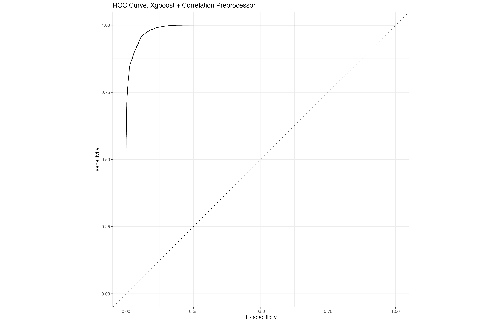

# Modeling Pipeline Case - Fraud Detection

## Introduction

The objective of this project was to develop a machine learning model to detect fraudulent transactions effectively. The model leverages historical transaction data to identify patterns and anomalies that are indicative of fraudulent activities.

## Problem Statement

Fraudulent transactions result in significant financial losses and pose a reputational risk to organizations. This project aims to build a model that can accurately classify transactions as legitimate or fraudulent, thus mitigating potential losses and enhancing fraud prevention strategies.

## Data Overview

* **Dataset:** Historical transaction data with labeled instances of fraudulent and legitimate transactions.
* **Features:** Transaction amount, transaction type, timestamp, location, and user demographics.
* **Size:** 1 million transactions with 3% labeled as fraudulent.

## Methodology

1. **Data Preprocessing:**

   * Data Cleaning: Removed null values and outliers.
   * Feature Engineering: Created new features to capture transactional behavior.
   * Data Splitting: 70% training, 30% testing.

2. **Model Selection:**

   * Logistic Regression
   * Random Forest
   * XGBoost (Selected Model)

3. **Model Evaluation:**

   * Accuracy, Precision, Recall, F1 Score, AUC-ROC.

4. **Deployment:**

   * Model deployed using a REST API for integration with transaction monitoring systems.

## Results and Findings

* The XGBoost model achieved an accuracy of **97%**, a recall of **92%**, and an AUC-ROC of **0.98**.
* High precision and recall indicate the model's effectiveness in minimizing false positives and false negatives.
* The model demonstrated robust performance on unseen data, validating its generalizability.

## Recommendations

* Integrate the model with real-time monitoring systems to detect fraud as transactions occur.
* Implement periodic retraining to maintain model accuracy with evolving fraud patterns.
* Develop a dashboard to visualize key fraud metrics and model performance.

## Next Steps

* Monitor model performance post-deployment.
* Incorporate feedback from fraud analysts to refine model features.
* Explore advanced algorithms such as neural networks for potential performance gains.

For more information and access to the model, please visit the [GitHub Repository](https://github.com/username/fraud-detection-model).
---

# Modeling Pipeline Case Assignment

If you thought the _last_ modeling pipeline assignment was fun, well, you're in for a real treat. This assignment will be the culmination of everything we've learned so far about building, refining, evaluating, and optimizing models using the `tidymodels` framework. Strap in. Because this is going to be a _blast_.

---

### 1. fraud, fraud_split, fraud_training, fraud_testing

The first dataset you'll be using is a fraud dataset that comes from real-world fraud data. Like most fraud datasets, the outcome you'll be classifying is extremely imbalanced (meaning that there are very few fraud cases relative to the rest of the population). This will give us a good opportunity to learn about a few strategies for dealing with imbalanced data. You'll be predicting `is_fraud` using a handful of other predictors, most of which have already been cleaned and transformed and have very uncreative names (`v1` through `v28`). 

Start by converting the `is_fraud` column to a factor, saving the result to `fraud`. Then use that `fraud` tibble to create a `fraud_split` object, followed by the corresponding `fraud_training` and `fraud_testing` tibbles. (Just make sure your code for this section comes _after_ the `set.seed(42)` I provided.)

> [!IMPORTANT] 
> After setting up your model pipeline, you should now have `fraud`, `fraud_split`, `fraud_training`, and `fraud_testing` objects in your environment.

---

### 2. fraud_rec_1, fraud_rec_2, fraud_rec_3

Next, you'll be creating three recipes that will allow us to compare a few different approaches to dealing with imbalanced data. Here's a description of each:
- The first recipe (`fraud_rec_1`) should be a basic recipe with no recipe steps added. 
- The second (`fraud_rec_2`) should address the right skewed shape of the `amount` column using a "YeoJohnson" transformation, then scale that column using a z-score. Then use the `step_downsample()` recipe step (from the `themis` package that was loaded at the beginning of the script). There are lots of parameters you _could_ supply to the `step_downsample()` function, but you can just leave them at their defaults. (You'll need to supply the `is_fraud` column to `step_downsample()` to tell it which column to use for the downsampling operation.) 
- The third (`fraud_rec_3`) should add recipe steps that address the right skewed shape of the `amount` column using a BoxCox transformation, then scale that column using a z-score. Then additionally apply the `step_upsample()` recipe step (also from the `themis` package), used with its defaults like we did in the previous recipe.

> [!TIP]
> Because there are some zeros in the `amount` column, the BoxCox recipe step will complain and tell you it doesn't want to work on any non-positive columns. So in order to get the BoxCox recipe to work, you'll probably want to add a `step_mutate()` or `step_range()` recipe step to shift the values in the `amount` column so that there are none that are zero or less.
>
> To help give you confidence that you're on the right track, if you send `fraud_rec_2` to the console, you should see the following output:
> ```
> > fraud_rec_2
>
> ── Recipe ──────────────────────────────────────────────────────
> 
> ── Inputs 
> Number of variables by role
> outcome:    1
> predictor: 30
> 
> ── Operations 
> • Yeo-Johnson transformation on: amount
> • Centering and scaling for: amount
> • Down-sampling based on: is_fraud
> ```

> [!IMPORTANT] 
> After accomplishing the above, you should now have `fraud_rec_1`, `fraud_rec_2`, and `fraud_rec_3` objects in your environment.

---

### 3. peek_1, peek_2, peek_3, plot_1, plot_2

Now let's examine the effect of applying these different recipes to our training data. There are some dedicated functions that can be used to see the effect of the transformations you've planned out using your recipes. We don't apply them very often because recipes are usually just bundled with model training, but we're going to use them here so you can learn about handling imbalanced data like this.

The two functions have too-cute-for-their-own-good names that relate to the "recipe" analogy. They can be used like this:

```
fraud_rec_1 %>% prep() %>% bake(new_data = fraud_training)
```

If you execute that code, you'll see that the recipe has automatically used the data you provided when creating it (i.e., `fraud_training`), applying the recipe instruction "steps" and returning the resulting data so we can _peek_ at it to see the result. (Of course, for the first recipe, there is no change to the data because we added no steps.) 

Anyway, go ahead and use `prep()` and `bake()` with the first, second, and third recipes, saving the results to `peek_1`, `peek_2`, and `peek_3`, respectively. As you're saving them, add a new column to each called `recipe` so that when we bind them together in the next step, we can tell which recipe the data came from. The `recipe` column should contain the name of the recipe from which the data came (e.g., "fraud_rec_1" for the data baked from `fraud_rec_1`).

> [!TIP]
> Don't be alarmed when the three `peek_*` tibbles have very different row counts. The sampling recipe steps we added to the second and third recipes are _expected_ to have this effect.

Using the three "peeks," tibbles, create the plot you see below (saved as `plot_1`). Notice the differences in counts of 1's and 0's in the `is_fraud` column across the three tibbles. See what downsampling does? And upsampling? 


Next, create the plot you see below (saved as `plot_2`). Notice what the YeoJohnson and BoxCox transformations have done with the extreme skewness in the `amount` column. (Remember that they were also normalized, which is why they range from -2 to 3 or 4.) The two transformation techniques don't always produce such similar results, but in this case it appears that there isn't a lot of difference between the two. (I'll often test both and see which one seems to work better on the data I'm working with.)


> [!IMPORTANT] 
> After accomplishing the above, you should now have `peek_1`, `peek_2`, `peek_3`, `plot_1`, and `plot_2` objects in your environment.

---

### 4. lr_spec, xgb_spec, fraud_wkfl_1, fraud_wkfl_2, fraud_wkfl_3, fraud_wkfl_4, fraud_wkfl_5, fraud_wkfl_6

Now let's explore which of our recipes provide the best model performance. Start by creating two model specifications, one for logistic regression model using the `glm` engine (saved as `lr_spec`) and another for a boosted tree model using the `xgboost` engine (saved as `xgb_spec`). 

Next, create 6 different workflows with the following combinations of recipe and model specification:
- `fraud_wkfl_1` with `fraud_rec_1` and `lr_spec` 
- `fraud_wkfl_2` with `fraud_rec_2` and `lr_spec`
- `fraud_wkfl_3` with `fraud_rec_3` and `lr_spec`
- `fraud_wkfl_4` with `fraud_rec_1` and `xgb_spec` 
- `fraud_wkfl_5` with `fraud_rec_2` and `xgb_spec`
- `fraud_wkfl_6` with `fraud_rec_3` and `xgb_spec`

> [!IMPORTANT] 
> After accomplishing the above, you should now have `lr_spec`, `xgb_spec`, `fraud_wkfl_1`, `fraud_wkfl_2`, `fraud_wkfl_3`, `fraud_wkfl_4`, `fraud_wkfl_5`, and `fraud_wkfl_6` objects in your environment.

---

### 5. fraud_metric_set, fraud_fit_1, fraud_fit_2, fraud_fit_3, fraud_fit_4, fraud_fit_5, fraud_fit_6

Alright, let's train these models! But first, we need to make sure that we can compare the recipes and models along all of the relevant performance metrics. By default, `tidymodels` will produce `accuracy` and `roc_auc` for classification models. For this fraud data, `roc_auc` is a useful metric, but what about `accuracy`? Remember how accuracy can be misleading when the outcome variable is so rare? For fraud models, recall and specificity are much more appropriate metrics to use.

To allow us to compare the six workflows with these other metrics, we need to use the `metric_set()` function to create a special tibble that we'll pass to each of the training function calls. Teach yourself how to do this and save the result as `fraud_metric_set`. 

> [!TIP]
> Because this is new for you, here's what the `fraud_metric_set` will look like when you get it right:
> ```
> > fraud_metric_set
> # A tibble: 3 × 3
>   metric      class        direction
>   <chr>       <chr>        <chr>    
> 1 recall      class_metric maximize 
> 2 roc_auc     prob_metric  maximize 
> 3 specificity class_metric maximize 
> ```

Now, at long last, we can train and evaluate these workflows. Use the `last_fit()` function to efficiently fit and evaluate each of the six workflows, being sure to provide the `fraud_metric_set` you created above so we get the metrics we need for comparison below. Save the resulting model fit objects to `fraud_fit_1` through `fraud_fit_6`. 

> [!TIP]
> When you run the logistic regression models, you'll likely see some warning messages about "fitted probabilities numerically 0 or 1" occurring. This is a somewhat common occurrence with logistic regression models, and it's not something we're going to worry about for this assignment. You can safely ignore them.

> [!IMPORTANT] 
> After accomplishing the above, you should now have `fraud_metric_set`, `fraud_fit_1`, `fraud_fit_2`, `fraud_fit_3`, `fraud_fit_4`, `fraud_fit_5`, and `fraud_fit_6` objects in your environment.

---

### 6. fraud_perf_summary

Alrighty! Let's compare these 6 different models to see which combination produces the best all-around performance. You can use `collect_metrics()` to extract the performance metrics from each fit object. As you're doing so, add two columns (`recipe` and `algorithm`) that correspond to the name of the recipe and an abbreviated algorithm label, respectively, that will allow you to see which recipe and algorithm produced each result. (For example, the values for `fraud_fit_1` would be "fraud_rec_1" and "lr".) Do this extraction procedure for each of the six fit objects, bind them all together, and then arrange the result in order of the metric (ascending) and estimate (descending). Save the result to `fraud_perf_summary`. 

> [!TIP]
> Here's a preview of what the first row of the `fraud_perf_summary` tibble looks like:
> ```
>    .metric     .estimator .estimate .config              recipe      algorithm
>    <chr>       <chr>          <dbl> <chr>                <chr>       <chr>    
>  1 recall      binary         1.00  Preprocessor1_Model1 fraud_rec_1 xgb      
> ```

Have a look at the contents of `fraud_perf_summary`. What patterns do you see across the various recipe strategies and model algorithms? Which algorithm tends to be the best? Keeping in mind that the primary difference between the first recipe and the other two was the downsampling/upsampling strategy used (see `plot_1`), notice what effect that had on the performance metrics, especially specificity. See how much worse specificity was when the training data was left extremely imbalanced? 

Pretty cool, right? I think so, too.

> [!IMPORTANT] 
> After accomplishing the above, you should now have the `fraud_perf_summary` object in your environment.

---

### 7. air, air_split, air_training, air_testing

On to the next dataset! This one summarizes passengers' reported satisfaction with their experience during a flight. The target variable is `satisfied`, a binary indicator of whether they were satisfied or not. The other columns are all features related to the flight and/or the passenger. 

Start by converting the target variable (saving the data as `air`), then creating the train/test split and deriving both the training and testing tibbles. You can name each of those `air_split`, `air_training`, and `air_testing`, respectively.

> [!IMPORTANT] 
> After accomplishing the above, you should now have `air`, `air_split`, `air_training`, and `air_testing` objects in your environment.

---

### 8. air_rec_corr, air_rec_pca, peek_4, peek_5

We're going to do another comparison of different data preprocessing setups with different recipe configurations. Specifically, you'll create two different recipes that are identical except for the last step. Both recipes will have the following: 
- median imputation for all numeric features
- Yeo Johnson transformations for all numeric features
- standardization (z-score conversion) for all numeric features
- dummy coding for the category features
- a near zero variance filter to remove features that have very little variance 

Again, both recipes should have the steps above. Then, as the last step on each recipe, you'll add two different approaches for dimension reduction. The first recipe (saved as `air_rec_corr`) will use a correlation-based filter (with default threshold) while the second recipe (saved as `air_rec_pca`) will use a principal components analysis to reduce the many columns down to several principal components. 

Then we'll use workflows again to pair these two different recipes with two algorithms to explore which dimension reduction approach provides better performance with this data. Before we do that, however, let's use the `prep()` and `bake()` method that we used above to save two more peeks of the transformed training data, just so you can see how different the two recipes are. Save the results of baking the `air_rec_corr` and `air_rec_pca` recipes to `peek_4` and `peek_5`, respectively. Notice that the two dimension reduction approaches produce _very_ different end results. (And we won't do anything else with those "peek" tibbles.)

> [!IMPORTANT] 
> After accomplishing the above, you should now have `air_rec_corr`, `air_rec_pca`, `peek_4`, and `peek_5` objects in your environment.

---

### 9. air_lr_corr_wkfl, air_lr_pca_wkfl, air_xgb_corr_wkfl, air_xgb_pca_wkfl

Next, let's set ourselves up to compare the recipes across the logistic regression and xgboost algorithms. (Note that the `lr_spec` and `xgb_spec` objects we created for the last dataset can be reused here.) Using both recipes and both model specifications, create four workflows named `air_lr_corr_wkfl`, `air_lr_pca_wkfl`, `air_xgb_corr_wkfl`, and `air_xgb_pca_wkfl`, corresponding to the algorithm and recipe combinations suggested by their names. 

> [!IMPORTANT] 
> After accomplishing the above, you should now have `air_lr_corr_wkfl`, `air_lr_pca_wkfl`, `air_xgb_corr_wkfl`, and `air_xgb_pca_wkfl` objects in your environment.

---

### 10. air_folds, air_lr_corr_cv_fit, air_lr_pca_cv_fit, air_xgb_corr_cv_fit, air_xgb_pca_cv_fit

Now let's do a robust evaluation of each of the four workflows in terms of how they compare on the standard classification performance metrics (meaning that you don't need to make a custom set of metrics like we did for the previous dataset). Setup a 10-fold cross-validation (saved to `air_folds`) with the default of 1 repeat, then use that folds object to obtain cross-validated modeling results for each of the four workflows, saving the results to `air_lr_corr_cv_fit`, `air_lr_pca_cv_fit`, `air_xgb_corr_cv_fit`, and `air_xgb_pca_cv_fit`. 

> [!IMPORTANT] 
> After accomplishing the above, you should now have `air_folds`, `air_lr_corr_cv_fit`, `air_lr_pca_cv_fit`, `air_xgb_corr_cv_fit`, and `air_xgb_pca_cv_fit` objects in your environment.

---

### 11. air_perf_summary, air_final_fit, plot_3 

Next, construct a summary tibble that displays the minimum, average, maximum, and standard deviation of the `roc_auc` metric. This will give you a slightly more complete picture of the consistency of performance across the 10 folds for each workflow. Again, mutate a column (this time called `workflow`) that tags each of the results with a label designating the workflow used to generate the result. Save the resulting tibble to `air_perf_summary`.

> [!TIP]
> There is a parameter option in `collect_metrics()` that will allow you to extract detailed performance metrics for each of the many models that are run during a cross-validated fit rather than the summarized set of metrics. You can then do some binding, grouping, and summarizing to get the results that you're looking for. Below is a preview of one of the rows in my `air_perf_summary` tibble (though don't be too concerned if your numbers don't match exactly):
> ```
>   workflow          minimum  mean maximum      sd
>   <chr>               <dbl> <dbl>   <dbl>   <dbl>
> 1 air_lr_corr_wkfl    0.924 0.928   0.931 0.00278 
> ```

Given the results, there appears to be a pretty clear winner in terms of both performance and consistency. Use that workflow and the `last_fit()` function to obtain the finalized model object (saved to `air_final_fit`). Just to show that we can, let's go ahead and create a ROC Curve plot using the predictions from that model. Extract the predictions from `air_final_fit`, then use the ROC curve functions we used in class to create a nice-and-curvy ROC curve plot. Add an appropriate title similar to the one you see in the example plot below, then save the plot as `plot_3`.

> [!TIP]
> The `autoplot()` function we learned to use in class is a convenience function that takes care of a bunch of `ggplot` magic without you having to do it manually. But the function returns a ggplot plot just like any other plot you've made, which means you can use standard ggplot helper functions like `labs()` to add additional customization layers.



> [!IMPORTANT] 
> After accomplishing the above, you should now have `air_perf_summary`, `air_final_fit`, and `plot_3` objects in your environment.

---

### 12. lc_*

Okay. Final dataset and model. This data comes from the lending activities of Lending Club (a fintech lender I worked with at Neuro-ID), and each row in the dataset represents a loan that was issued during the year 2019. The target variable is `loan_default`, and your job is to build and then tune a model that helps predict whether a loan is going to be repaid or not.

On purpose, I'm not going to be very prescriptive on this last exercise. You should be less concerned about whether you've set up or tuned your model exactly the same way as I have. I'm more interested in you thinking through the modeling pipeline process and using what we've learned in class to get to a model that is ready to deploy.

Below, I'll list each of the objects that I ended up with after building and tuning this loan default model. First, though, here are a few things to keep in mind:

- We're going to be running a lot of models during the tuning process, so to speed things up we are going to use xgboost and very little pre-processing in terms of recipe steps. (Xgboost is actually very robust in terms of data shape, missingness, etc., so we don't have to worry as much about getting the data perfect for the model; either way, removing a bunch of processing will save you some time during the grid search, so that's what we'll be doing.) So when you build your recipe, I would suggest that you add just one pre-processing step: `step_dummy(all_nominal_predictors())`.
- I'm setting my seed each time I (a) do a random assignment (e.g., `initial_split()` or `vfold_cv()`), (b) run any xgboost fit procedure, or (c) when I generate my tuning grid. (Again, I'm not going to be too worried about whether your model results are the same, so it won't matter as much for this exercise.) Just letting you know the thought process behind how I usually setup my seeds that create repeatability in my workflow.
- It's usually a good idea to do an initial, cross-validated model with the "default" xgboost parameters, and then add a "tunable" model spec that you use for tuning and comparison. You'll see in the list below that I've taken this approach.
- The full tuning process can take a while, and you don't want to be waiting around for your code to run (especially if you're working on this at the last minute). I would suggest keeping your search grid to 10 or fewer (even though that's smaller than what we would usually do out in the wild). 
- You can also speed the tuning up considerably if you do the grid search in parallel on multiple processor cores. There is a wonderfully usable way to do this in the form of a package: `doParallel`. After installing the package, you can initiate a parallel process by calling `doParallel::registerDoParallel()` before you do your `tune_grid()` operation. This works a bit more smoothly on Mac/Linux machines than on Windows machines, but either way I'd recommend playing around with it a bit (and monitoring your processor consumption while it's running) because it's somehow just _fulfilling_ to see your machine firing on all cylinders. (And if you don't want to mess with this, you don't need to; it'll just mean more waiting while your computer runs through the grid search sequentially. Obviously you can reach out on Slack if you have questions about this.)
- The xgboost algorithm has a lot of tunable settings. If you want some background reading on what the various settings do, you can read about them [here](https://www.kaggle.com/code/prashant111/a-guide-on-xgboost-hyperparameters-tuning/notebook). Just try not to read through the parameter descriptions shortly before going to bed, because they are **so** exciting that you'll probably get all worked up and then not be able to sleep.
- Within the `tidymodels` implementation of the xgboost algorithm, you can see the main parameters available for tuning in the documentation for the `boost_tree()` function. I would avoid tuning the `mtry` or `trees` parameters. Tuning the `trees` parameter in particular will increase your processing time _significantly_, so if you're short on time you should **definitely** leave that one out. (More trees will likely get you better performance, but I wouldn't use more than about 300-500 trees regardless.)

Okay. With the above in mind, here's a list of the objects that I used to build out my model pipeline, and I'm listing them in the order that I added them to help guide you a bit:

- `lc_split`: the initial 75/25 split object
- `lc_training`: the training data
- `lc_testing`: the testing data
- `lc_rec`: the (single-step) recipe
- `xgb_spec_default`: xgboost model spec with default parameters
- `lc_xgb_wkfl`: workflow comprised of `lc_rec` and `xgb_spec_default`
- `lc_folds`: the 10-fold cross-validation object (no repeats to save time)
- `lc_default_fit`: the fit of the 10-fold cross-validation using the default workflow
- `xgb_spec_tuning`: a different xgboost model spec with tunable parameters
- `lc_xgb_tune_wkfl`: a different workflow that bundles `lc_rec` and `xgb_spec_tuning`
- `lc_grid`: the tuning grid (again, I would keep this sized to 10 or so unless you have lots of breathing room). You can use `grid_random()` to generate this, but there are others out there as well.
- `tune_fit`: The result of the grid search (i.e., `tune_grid()`)
- `best_parameters`: the best-performing parameter set from your grid search
- `final_lc_wkfl`: a final modeling workflow, derived from applying those `best_parameters` to the `lc_xgb_tune_wkfl` workflow.
- `lc_final_fit`: The end result, a deployable model object that results from finalizing the `final_lc_wkfl` with the `lc_split` object.

> [!IMPORTANT] 
> After accomplishing the above, you should now have _all of the objects listed above_ in your environment. (I'm not going to list them again here...)

#### 🚨 Model Tuning Competition 🚨

If you are having fun with this and want to see how high you can get your model's performance, then go for it. I will gladly reward the top 3 students whose model performance is the highest in the class. The reward is your choice of either (a) extra credit (boring) or (b) I'll take you and a friend/spouse surfing on my boat sometime this coming summer. Performance will be measured in terms of `roc_auc`, and I'll maintain a pseudonymous "leaderboard" of the top AUCs that have been achieved and share those on Slack periodically until the assignment deadline. 

Any strategy is fair game, as long as you use the provided data and demonstrate your performance on the random 25% holdout test set produced from the `initial_split()` function immediately following a `set.seed(42)` command, and use the `tidymodels` suite to build your model. 

To submit your `roc_auc` for the competition, simply fill out [this form](https://byu.az1.qualtrics.com/jfe/form/SV_3wtj8UGH37OSDAO). (You can resubmit that form as many times as you'd like, so feel free to submit your starting point and then keep tweaking and exploring.) 

Good luck!

---

# Final Cleanup and Submission

Please do the following to make sure your code runs without errors and passes the submission checks:

1. Run the "Pre-Submission Checks" section to check whether you saved (and spelled) all of the expected variables and columns along the way. Take care of any issues it uncovers.
2. Restart your R session (Session >> Restart R).
3. Run your entire script from the beginning, watching for any errors along the way. Easiest way to do this is to "Select All" and then hit "Run". If you have any errors (including in the Pre-Submission Checks section), you'll want to fix them before submitting.
